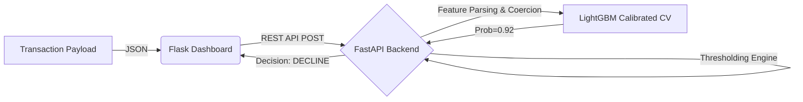

<div align="center">
  

  # 🛡️ Real-Time Fraud Detection Engine

  [](https://git.io/typing-svg)
  
  [](https://tinyurl.com/38rtjatu)

</div>

<br>

## 🌐 Live Dashboard
Experience the real-time scoring engine via our live interactive dashboard:
👉 **[Access the Live Demo Here](https://tinyurl.com/38rtjatu)**

---

## 🧠 About The Project
This project is a complete end-to-end Machine Learning pipeline that identifies fraudulent credit card transactions in real-time. Evolving from the Kaggle IEEE-CIS Fraud Detection dataset, it implements the **1st-place winning "Magic Features"** (47+ Client UID aggregations) to achieve state-of-the-art predictive performance.

### 🌟 Key Features
- **Real-Time Scoring API**: Ultra-fast predictions served via a containerized FastAPI backend.
- **Kaggle Magic Features**: Time-series grouping and frequency encoding across unique Client UIDs to link historical behavior.
- **MLOps Pipeline**: Fully reproducible data processing, model training, and evaluation pipelines tracked with **DVC** and **MLflow**.
- **Interactive Dashboard**: A Flask-based UI mimicking a live payment gateway investigator dashboard.

---

## 📈 Model Performance
Using a heavily tuned **LightGBM** Calibrated Classifier, the model achieves massive reductions in False Positives while aggressively catching fraud.

* **ROC-AUC**: `0.932`
* **Precision (at best F1)**: `66.84%`
* **Recall (Top 5% Risk)**: `63.73%`

---

## 🛠️ Tech Stack
<p align="center">
  
  
  
  
  
  
  
  
</p>

---

## 🚀 Quick Start (Local Setup)

Want to run the full stack locally on your own machine?

1. **Clone the repository**
   ```bash
   git clone https://github.com/vyash0048-bit/Fraud_Detection.git
   cd Fraud_Detection
   ```

2. **Pull the Model Weights via DVC**
   ```bash
   dvc pull
   ```

3. **Spin up the Environment via Docker**
   ```bash
   docker-compose up --build -d
   ```
   *The FastAPI server will boot up on `localhost:8000` and the interactive Dashboard on `localhost:5000`.*

---

## 🏗️ Architecture



---
<div align="center">
  <i>Built with ❤️ for catching bad actors.</i>
</div>
