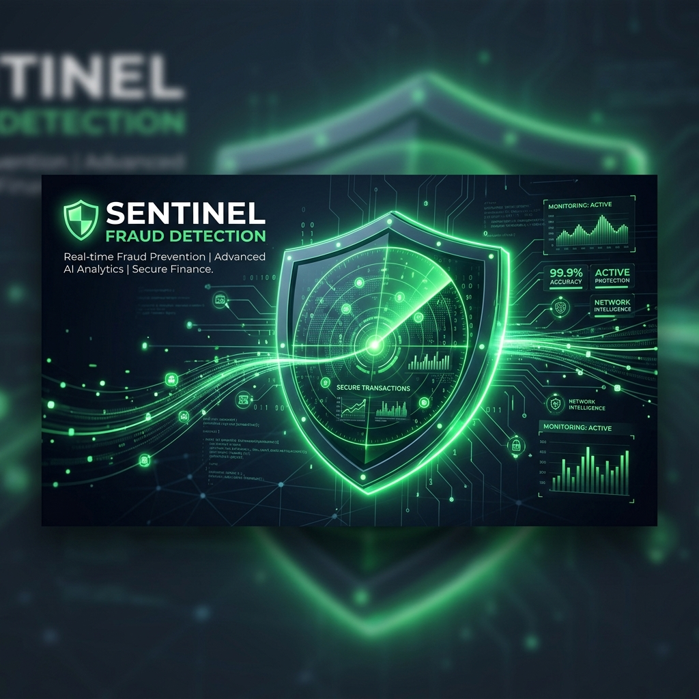
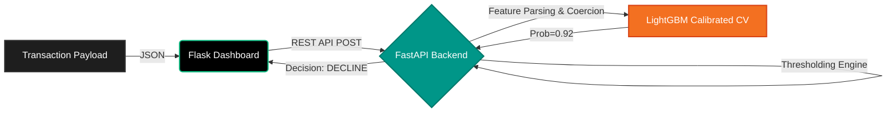

<div align="center">
  
  
  <br>

  <h1 align="center">🛡️ Sentinel | Real-Time Fraud Detection Engine</h1>

  <!-- Animated Typing SVG -->
  [](https://git.io/typing-svg)
  
  [](https://tinyurl.com/38rtjatu)
  [](LICENSE)

</div>

<br>

## 🌐 Live Dashboard
Experience the real-time scoring engine via our live interactive dashboard. The dashboard features micro-animations, real-time gauges, and dynamic metrics updates.
👉 **[Access the Live Demo Here](https://tinyurl.com/38rtjatu)**

---

## 🧠 About The Project
This project is a complete end-to-end Machine Learning pipeline that identifies fraudulent credit card transactions in real-time. Evolving from the Kaggle IEEE-CIS Fraud Detection dataset, it implements the **1st-place winning "Magic Features"** (47+ Client UID aggregations) to achieve state-of-the-art predictive performance.

### 🌟 Key Features
- **Real-Time Scoring API**: Ultra-fast predictions served via a containerized FastAPI backend.
- **Kaggle Magic Features**: Time-series grouping and frequency encoding across unique Client UIDs to link historical behavior.
- **MLOps Pipeline**: Fully reproducible data processing, model training, and evaluation pipelines tracked with **DVC** and **MLflow**.
- **Interactive Dashboard**: A highly polished Flask-based UI mimicking a live payment gateway investigator dashboard with HSL dark-mode aesthetics and fluid animations.

---

## 📈 Model Performance
Using a heavily tuned **LightGBM** Calibrated Classifier, the model achieves massive reductions in False Positives while aggressively catching fraud.

| Metric | Score | Impact |
| :--- | :---: | :--- |
| **ROC-AUC** | `0.932` | Top-tier distinction between fraud/legit |
| **Precision** | `66.84%` | High confidence on flagged transactions |
| **Recall (Top 5%)** | `63.73%` | Captures majority of fraud in high-risk bin |

---

## 🛠️ Tech Stack
<div align="center">
  
  
  
  
  
  
  
  
</div>

---

## 🚀 Quick Start (Local Setup)

Want to run the full stack locally on your own machine?

1. **Clone the repository**
   ```bash
   git clone https://github.com/vyash0048-bit/Fraud_Detection.git
   cd Fraud_Detection
   ```

2. **Pull the Model Weights via DVC**
   ```bash
   dvc pull
   ```

3. **Spin up the Environment via Docker**
   ```bash
   docker-compose up --build -d
   ```
   *The FastAPI server will boot up on `localhost:8000` and the interactive Dashboard on `localhost:5000`.*

---

## 🏗️ Architecture



---
<div align="center">
  
</div>
